# Runtime Flows

This doc explains how data moves through the system.

## Flow 1: Capture

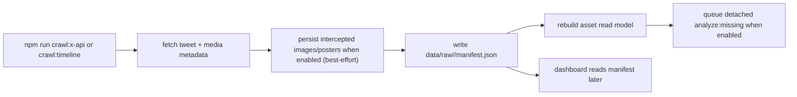

Key files:

- [`src/cli/crawl-x-api.ts`](/Users/nicklocascio/Projects/twitter-trend/src/cli/crawl-x-api.ts)
- [`src/server/x-api-capture.ts`](/Users/nicklocascio/Projects/twitter-trend/src/server/x-api-capture.ts)
- [`src/server/x-api.ts`](/Users/nicklocascio/Projects/twitter-trend/src/server/x-api.ts)
- [`src/cli/crawl-timeline.ts`](/Users/nicklocascio/Projects/twitter-trend/src/cli/crawl-timeline.ts)
- [`src/lib/extract-tweets.ts`](/Users/nicklocascio/Projects/twitter-trend/src/lib/extract-tweets.ts)

Outputs:

- `data/raw/<run-id>/manifest.json`
- media files inside the run’s raw directory when capture persistence is enabled
- persisted media keeps a compatibility `.bin` copy and, when the content type is known, a native sibling such as `.jpg`, `.png`, `.webp`, `.gif`, `.mp4`, or `.m3u8`; the manifest prefers the native path
- `manifest.capturedTweets` includes text-only tweets too; downstream media usage records are still created only for tweets whose `media[]` array is non-empty

Important detail:

- `crawl:x-api` is the primary home-timeline crawl command. `crawl:openclaw` remains as a compatibility alias. Home timeline capture calls `GET /2/users/:id/timelines/reverse_chronological`, and focused single-post capture calls `GET /2/tweets/:id`.
- Timeline capture needs `X_BEARER_TOKEN` with user-context access. If `X_USER_ID` is not set, the capture path asks `/2/users/me` for the authenticated user id.
- Auto-analysis after capture is now a detached follow-up process. Gemini failures or slowdowns should not fail the scrape once the manifest and asset rebuild have completed.
- Capture-triggered media refresh now defaults to an incremental asset sync: new usages are upserted into the existing asset index and only touched asset summaries are recomputed. Full corpus rebuilds are still available as an explicit maintenance operation.
- The focused current-tweet capture now looks up one tweet by status URL and saves that post plus its assets into the raw manifest.
- A second focused action chains that lookup into all-goals reply drafting, so the generated-drafts store gets one reply draft per reply goal for the captured top tweet.

Maintenance:

- `npm run media:backfill-native-types` scans previously saved raw media, creates missing native siblings for `.bin` files when type inference succeeds, and rewrites manifests to prefer the typed path.

## Flow 2: Build Dashboard Read Model

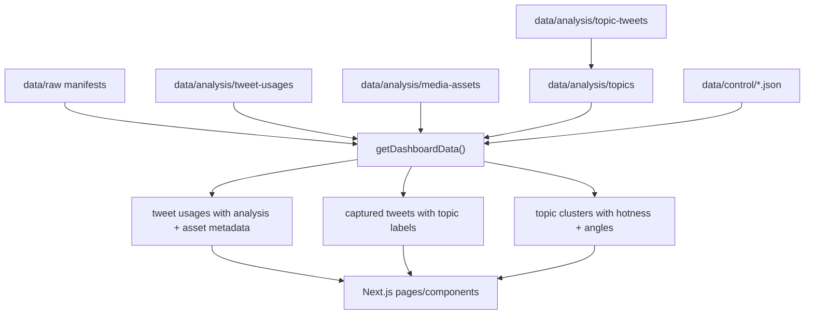

Key file:

- [`src/server/data.ts`](/Users/nicklocascio/Projects/twitter-trend/src/server/data.ts)

Important detail:

- This function synthesizes pending analyses for usages that exist in manifests but do not yet have saved analysis JSON.
- It also enriches each usage with asset-level metadata used by the UI, including duplicate-group counts, similar-match counts, and a time-decayed hotness score derived from duplicate frequency plus likes.
- It reads the cached `data/analysis/topics/index.json` topic index and exposes both per-tweet topic labels and aggregate topic clusters when that cache exists.
- When a media asset has a completed promoted-video analysis, the dashboard prefers that video-derived analysis over older poster/image usage analysis for display.

## Flow 3B: Analyze Tweet Topics

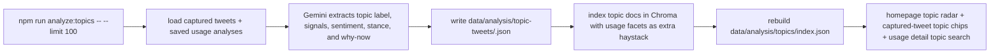

Key files:

- [`src/cli/analyze-topics.ts`](/Users/nicklocascio/Projects/twitter-trend/src/cli/analyze-topics.ts)
- [`src/server/analyze-topics.ts`](/Users/nicklocascio/Projects/twitter-trend/src/server/analyze-topics.ts)
- [`src/server/gemini-topic-analysis.ts`](/Users/nicklocascio/Projects/twitter-trend/src/server/gemini-topic-analysis.ts)
- [`src/server/topic-analysis-store.ts`](/Users/nicklocascio/Projects/twitter-trend/src/server/topic-analysis-store.ts)
- [`src/server/tweet-topics.ts`](/Users/nicklocascio/Projects/twitter-trend/src/server/tweet-topics.ts)

Important detail:

- This flow is intentionally explicit and cached so topic extraction does not run on every page load.
- The default batch is limited to 100 uncached tweets per run and processes one tweet at a time with an inter-item delay to avoid Gemini rate-limit spikes.
- Topic docs are searchable even when Chroma is cold because the search path falls back to lexical matching over cached topic analyses.

## Flow 3: Analyze One Usage

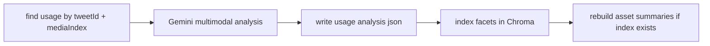

Key files:

- [`src/server/analysis-pipeline.ts`](/Users/nicklocascio/Projects/twitter-trend/src/server/analysis-pipeline.ts)
- [`src/server/gemini-analysis.ts`](/Users/nicklocascio/Projects/twitter-trend/src/server/gemini-analysis.ts)
- [`src/server/analysis-store.ts`](/Users/nicklocascio/Projects/twitter-trend/src/server/analysis-store.ts)
- [`src/server/chroma-facets.ts`](/Users/nicklocascio/Projects/twitter-trend/src/server/chroma-facets.ts)

Outputs:

- `data/analysis/tweet-usages/<usageId>.json`
- Chroma collection updates, when configured

Important detail:

- If the usage's media asset already has a promoted local video file, re-analysis prefers the video file over the poster/image source.
- `npm run analyze:all` reruns every saved usage analysis and overwrites the old usage-level JSON so prompt/schema improvements can be applied corpus-wide.

## Flow 4: Rebuild Media Assets

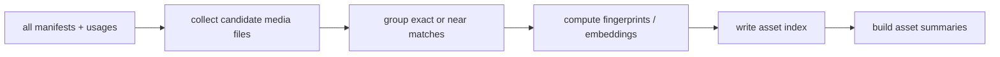

Key files:

- [`src/cli/rebuild-media-assets.ts`](/Users/nicklocascio/Projects/twitter-trend/src/cli/rebuild-media-assets.ts)
- [`src/server/media-assets.ts`](/Users/nicklocascio/Projects/twitter-trend/src/server/media-assets.ts)
- [`src/server/media-fingerprint.ts`](/Users/nicklocascio/Projects/twitter-trend/src/server/media-fingerprint.ts)
- [`src/server/media-embedding.ts`](/Users/nicklocascio/Projects/twitter-trend/src/server/media-embedding.ts)

Outputs:

- `data/analysis/media-assets/index.json`
- `data/analysis/media-assets/summaries.json`
- `data/analysis/media-assets/stars.json`

Important detail:

- When a promotable video is downloaded for an asset, the rebuild flow also triggers asset-video analysis so summaries and usage views can prefer video-derived semantics.

## Flow 5: Scheduling and Run Logging

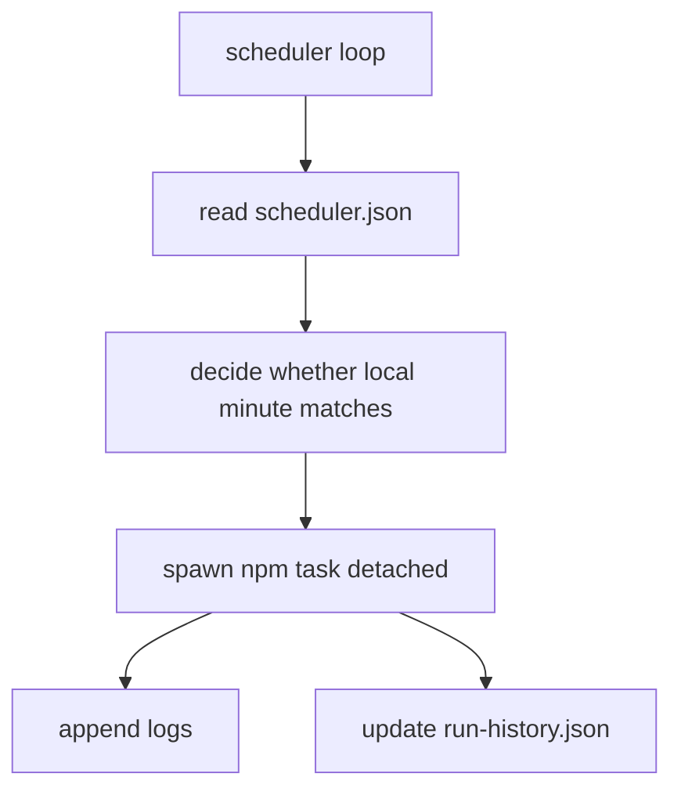

Key files:

- [`src/cli/scheduler.ts`](/Users/nicklocascio/Projects/twitter-trend/src/cli/scheduler.ts)
- [`src/server/run-control.ts`](/Users/nicklocascio/Projects/twitter-trend/src/server/run-control.ts)

## App Read Path

- [`app/page.tsx`](/Users/nicklocascio/Projects/twitter-trend/app/page.tsx) reads the dashboard aggregate.
- [`app/tweets/page.tsx`](/Users/nicklocascio/Projects/twitter-trend/app/tweets/page.tsx) reuses the captured-tweets browser with an all-tweets default, but now applies search and media filters before serving 200-tweet pages so large crawls stay responsive.
- [`app/replies/page.tsx`](/Users/nicklocascio/Projects/twitter-trend/app/replies/page.tsx) is a dedicated reply workspace for one pasted X status URL, with local-first lookup and X API fallback before composition.
- [`app/api/tweets/route.ts`](/Users/nicklocascio/Projects/twitter-trend/app/api/tweets/route.ts) exposes that same tweet-browser contract over HTTP with `page`, `limit`, `query`, and `filter` params, capped at 200 results per page.
- [`src/cli/search-tweets.ts`](/Users/nicklocascio/Projects/twitter-trend/src/cli/search-tweets.ts) exposes the same listing flow in the terminal through `x-media-analyst search tweets`.
- [`app/topics/page.tsx`](/Users/nicklocascio/Projects/twitter-trend/app/topics/page.tsx) shows the full topic cluster set instead of the homepage slice.
- [`app/api/search/topics/route.ts`](/Users/nicklocascio/Projects/twitter-trend/app/api/search/topics/route.ts) serves topic-search queries for the web app.
- [`app/matches/page.tsx`](/Users/nicklocascio/Projects/twitter-trend/app/matches/page.tsx) reuses the usage queue with matching filters.
- [`app/usage/[usageId]/page.tsx`](/Users/nicklocascio/Projects/twitter-trend/app/usage/[usageId]/page.tsx) reads one assembled detail record, including topic matches retrieved from the topic index / Chroma search path.

## Flow 6B: Compose A New Tweet From A Topic

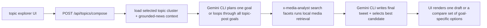

Key files:

- [`app/api/topics/compose/route.ts`](/Users/nicklocascio/Projects/twitter-trend/app/api/topics/compose/route.ts)
- [`src/server/topic-composer.ts`](/Users/nicklocascio/Projects/twitter-trend/src/server/topic-composer.ts)
- [`src/server/topic-composer-model.ts`](/Users/nicklocascio/Projects/twitter-trend/src/server/topic-composer-model.ts)
- [`src/server/topic-composer-prompt.ts`](/Users/nicklocascio/Projects/twitter-trend/src/server/topic-composer-prompt.ts)
- [`src/components/topic-tweet-composer.tsx`](/Users/nicklocascio/Projects/twitter-trend/src/components/topic-tweet-composer.tsx)

Important detail:

- This flow starts from a topic cluster, not a source tweet, so the model prompt is grounded in cluster hotness, representative tweets, suggested angles, and optional grounded-news context.
- Retrieval still uses the shared local media search path, which starts from facet search and now also merges in imported meme templates from `data/analysis/meme-templates`.
- Topic-post composition also saves its planned asset-retrieval terms into the shared wishlist so sourcing gaps discovered during original-post drafting are not lost.
- The compose route supports both a single selected topic-post goal and an `all_goals` compare mode so operators can review multiple original-post angles from the same topic in one run.
- Topic cards can deep-link into the composer with a preselected topic and auto-start a draft, so high-signal phrase clusters can be drafted directly from the card that surfaced them.
- The same topic-composer surface can also pivot into reply mode and hand a representative tweet to the shared reply composer, so operators can choose between posting a new take or responding to a linked example tweet.

## Flow 6C: Compose A New Tweet From A Media Asset

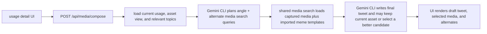

Key files:

- [`app/api/media/compose/route.ts`](/Users/nicklocascio/Projects/twitter-trend/app/api/media/compose/route.ts)
- [`src/server/media-post-composer.ts`](/Users/nicklocascio/Projects/twitter-trend/src/server/media-post-composer.ts)
- [`src/server/media-post-composer-model.ts`](/Users/nicklocascio/Projects/twitter-trend/src/server/media-post-composer-model.ts)
- [`src/server/media-post-composer-prompt.ts`](/Users/nicklocascio/Projects/twitter-trend/src/server/media-post-composer-prompt.ts)
- [`src/components/media-tweet-composer.tsx`](/Users/nicklocascio/Projects/twitter-trend/src/components/media-tweet-composer.tsx)

Important detail:

- This flow now treats the current asset as the default candidate, then searches the shared media path for alternates, including imported meme templates.
- When the model decides none of the alternates beat the current asset, it can keep the current media in place and still return a finished tweet.
- When a local file path exists, the prompt attaches the current media directly so Gemini CLI can inspect it while drafting.
- Media-post composition also appends its planned alternate-asset queries to the shared wishlist, using the same file-backed backlog as replies and topic posts.

## Flow 7: Compose A Reply With Matching Media

```mermaid
flowchart LR
  A["usage detail UI"] --> B["POST /api/reply/compose"]
  B --> C["load usage or first media usage for the tweet"]
  C --> D["run usage analysis first when the source media is still pending"]
  D --> E["Gemini CLI headless plans angle + search queries"]
  E --> F["shared media search runs facet retrieval plus imported meme templates"]
  F --> G["Gemini CLI headless picks best candidate + writes reply text"]
  G --> H["Gemini CLI cleanup pass rewrites the draft with stop-slop"]
  H --> I["UI renders reply draft, selected media, and alternates"]
```

Key files:

- [`app/api/reply/source/route.ts`](/Users/nicklocascio/Projects/twitter-trend/app/api/reply/source/route.ts)
- [`app/api/reply/compose/route.ts`](/Users/nicklocascio/Projects/twitter-trend/app/api/reply/compose/route.ts)
- [`src/server/reply-composer.ts`](/Users/nicklocascio/Projects/twitter-trend/src/server/reply-composer.ts)
- [`src/server/reply-composer-subject.ts`](/Users/nicklocascio/Projects/twitter-trend/src/server/reply-composer-subject.ts)
- [`src/server/reply-composer-model.ts`](/Users/nicklocascio/Projects/twitter-trend/src/server/reply-composer-model.ts)
- [`src/server/reply-media-search.ts`](/Users/nicklocascio/Projects/twitter-trend/src/server/reply-media-search.ts)
- [`src/server/reply-composer-prompt.ts`](/Users/nicklocascio/Projects/twitter-trend/src/server/reply-composer-prompt.ts)
- [`src/server/meme-template-search.ts`](/Users/nicklocascio/Projects/twitter-trend/src/server/meme-template-search.ts)

Important detail:

- The dedicated reply lab resolves the pasted status URL first: normalize it, look for the tweet in local artifacts, and run focused X API capture only when the tweet is missing.
- Once the tweet is present locally, subject resolution is shared with the rest of reply composition. Media-backed tweets still run the normal usage-analysis pipeline before drafting if their first usage is pending.
- Text-only tweets still pass through this flow, but they skip media analysis and compose against the tweet text plus local media retrieval results.
- This flow deliberately does not reuse the repo's Gemini API analysis path. Reply composition uses the installed `gemini` CLI in headless mode, while corpus retrieval still runs through the local `x-media-analyst search facets` CLI.

## Flow 8: Save A Draft To Typefully

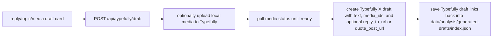

Key files:

- [`app/api/typefully/draft/route.ts`](/Users/nicklocascio/Projects/twitter-trend/app/api/typefully/draft/route.ts)
- [`src/server/typefully.ts`](/Users/nicklocascio/Projects/twitter-trend/src/server/typefully.ts)
- [`src/server/generated-drafts.ts`](/Users/nicklocascio/Projects/twitter-trend/src/server/generated-drafts.ts)
- [`src/components/post-to-x-button.tsx`](/Users/nicklocascio/Projects/twitter-trend/src/components/post-to-x-button.tsx)

Important detail:

- This path creates drafts only. Operators still approve or publish from Typefully itself.
- The Typefully save control supports `reply`, `quote_post`, and `new_post`, with reply as the default when no mode is specified.
- Replies use Typefully's `reply_to_url` setting, and quote posts use `quote_post_url`, so the draft stays anchored to a specific status URL without browser automation.
- Media uploads follow Typefully's three-step flow: request upload URL, PUT raw bytes, then poll until the returned `media_id` is ready.
- Media-post drafts that intentionally keep the current asset still persist that source file path into generated-draft history, so saving from `/drafts` does not drop the attachment.
- When a reply starts from a media tweet whose first usage is still pending, the server now runs the normal usage-analysis pipeline before planning the reply so Gemini gets real tweet/media facets instead of the null fallback subject.
- The Gemini CLI prompt tells `gemini` to load `@.agents/skills/stop-slop/SKILL.md` during planning, initial composition, and a dedicated cleanup pass that rewrites the final draft before it is accepted.
- The final drafting prompt also tells `gemini` it may use the `nano-banana` skill to adapt an image candidate with caption text or simple meme edits when that makes the pairing land better.
- After the cleanup call returns, the server also normalizes unicode punctuation locally so em dashes, curly quotes, and similar characters do not leak into saved drafts.
- Imported meme templates under `data/analysis/meme-templates` now flow into the same candidate list as captured-media search results, so reply composition can choose a local template image even though those records are not part of Chroma facet indexing.
- Wishlist asset import now tries meming.world first, then falls back to Gemini Google Search grounding plus generic webpage image extraction when no usable meming.world result exists.

## Flow 8: Persist Generated Drafts

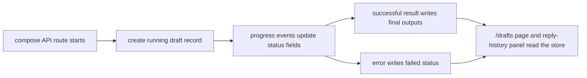

Key files:

- [`app/api/reply/compose/route.ts`](/Users/nicklocascio/Projects/twitter-trend/app/api/reply/compose/route.ts)
- [`app/api/topics/compose/route.ts`](/Users/nicklocascio/Projects/twitter-trend/app/api/topics/compose/route.ts)
- [`app/api/media/compose/route.ts`](/Users/nicklocascio/Projects/twitter-trend/app/api/media/compose/route.ts)
- [`app/api/generated-drafts/route.ts`](/Users/nicklocascio/Projects/twitter-trend/app/api/generated-drafts/route.ts)
- [`src/server/generated-drafts.ts`](/Users/nicklocascio/Projects/twitter-trend/src/server/generated-drafts.ts)

Important detail:

- Draft persistence is file-backed under `data/analysis/generated-drafts/index.json`.
- Records are created when a compose job starts, updated as progress streams, and marked `complete` or `failed` at the end.
- The reply composer reads recent reply history from that shared store, and `/drafts` is forced dynamic so fresh file-backed writes show up without waiting for a cached page to expire.
- The planning step now sets an explicit reply stance (`agree`, `disagree`, or `mixed`) before retrieval. `critique` is intended to produce actual pushback rather than agreement in a meaner voice.
- The compose route supports both a single selected goal and an `all_goals` batch mode. Batch mode now loads the shared subject once, fans out goals in parallel up to the request's `maxConcurrency`, and streams running / queued / completed counters back to the UI so operators can compare several reply/media pairings side by side without losing track of the batch.
- Reply composition can now start from either a media usage or a captured tweet without media. Text-only tweets still skip corpus analysis, but the reply composer can use the tweet text alone and optionally choose supporting media from the local corpus.
- Every composer flow now appends its planned asset-retrieval terms to `data/analysis/reply-media-wishlist.json`, deduped by wishlist key so operators can grow one shared sourcing backlog even when some local matches already exist.
- The server owns the orchestration as `plan -> search -> compose -> cleanup`, so Gemini-specific behavior stays behind the model adapter and can be swapped later without rewriting the UI.

## Flow 8: Import A Wishlist Meme From Meming.world

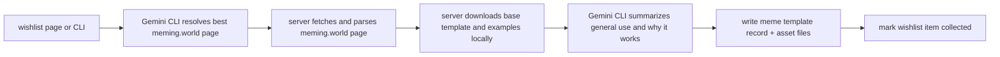

Key files:

- [`src/server/meme-template-import.ts`](/Users/nicklocascio/Projects/twitter-trend/src/server/meme-template-import.ts)
- [`src/server/meme-template-gemini.ts`](/Users/nicklocascio/Projects/twitter-trend/src/server/meme-template-gemini.ts)
- [`src/server/meming-world.ts`](/Users/nicklocascio/Projects/twitter-trend/src/server/meming-world.ts)
- [`src/server/meme-template-store.ts`](/Users/nicklocascio/Projects/twitter-trend/src/server/meme-template-store.ts)
- [`app/api/reply-media-wishlist/import/route.ts`](/Users/nicklocascio/Projects/twitter-trend/app/api/reply-media-wishlist/import/route.ts)
- [`src/cli/import-meme-template.ts`](/Users/nicklocascio/Projects/twitter-trend/src/cli/import-meme-template.ts)

Important detail:

- The app still does not use a live SQL database in the runtime path. Imported meme templates are stored as JSON plus local image files under `data/analysis/meme-templates/`.
- Gemini CLI is used for page resolution and usage summarization, while Meming Wiki page parsing and image downloading are deterministic server-side steps.
- The import route streams NDJSON progress events so the wishlist UI can show live status while research, page fetch, asset resolution, downloads, and save steps run.
